# APRESENTAÇÃO E INSTRUÇÕES PARA O USO DO SITE

Ao abrir a página, você terá a opção de navegar entre a tela de cadastro ou a de lista de cadastros.
A página padrão é a de cadastro:
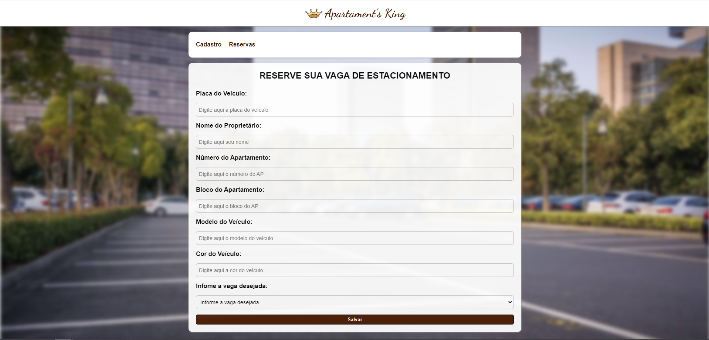

A página não aceita enviar o formulário se não cadastrar todos os dados:
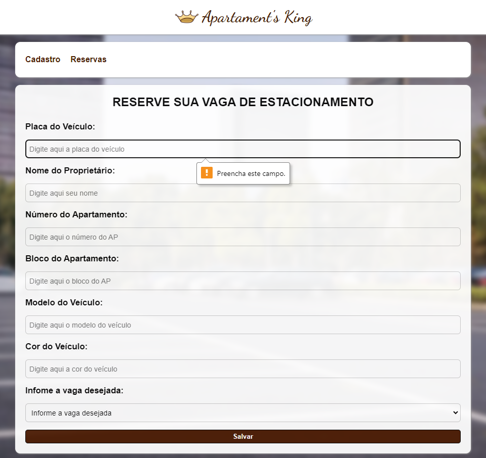

A página possui validação nos campos, onde na placa aceita no máximo 7 dígitos, número do apartamento só aceita números, estes sendo de 1 à 300, e bloco do apartamento só aceita 1 caractere:
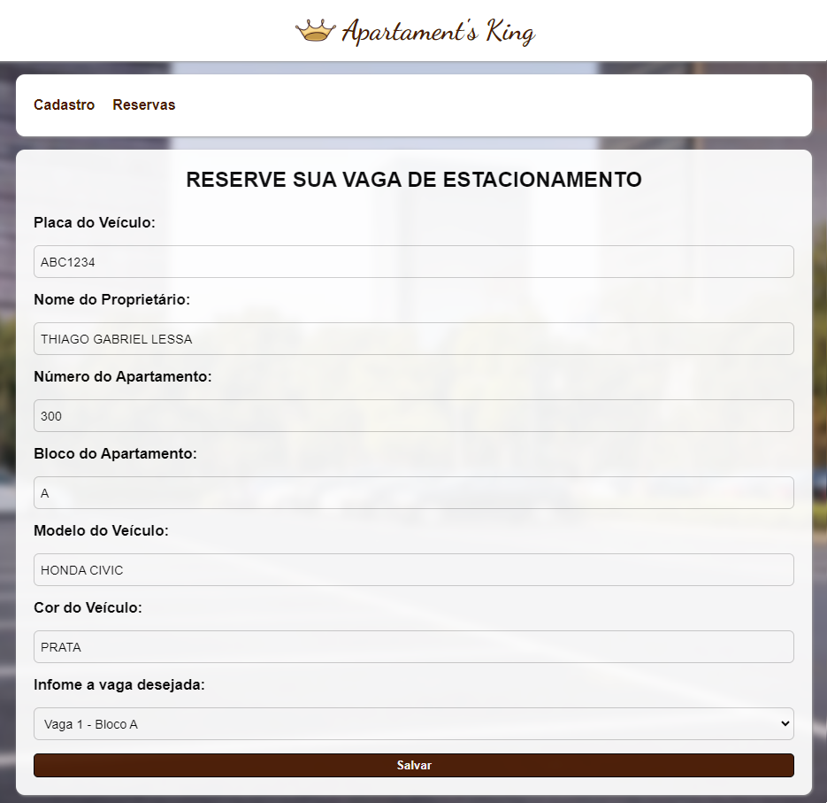

A tela é responsiva:
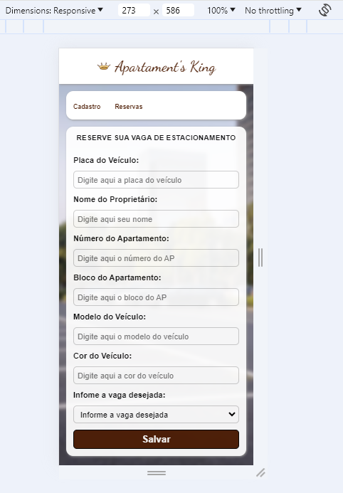

Ao enviar o formulário, aparece um pop-up confirmando o envio e as informnações de cadastro aparecem no console:
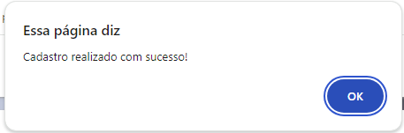
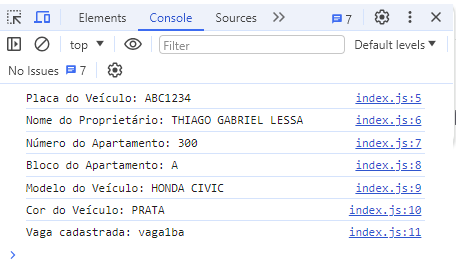

A segunda página mostra a lista das vagas reservadas e das disponíveis:
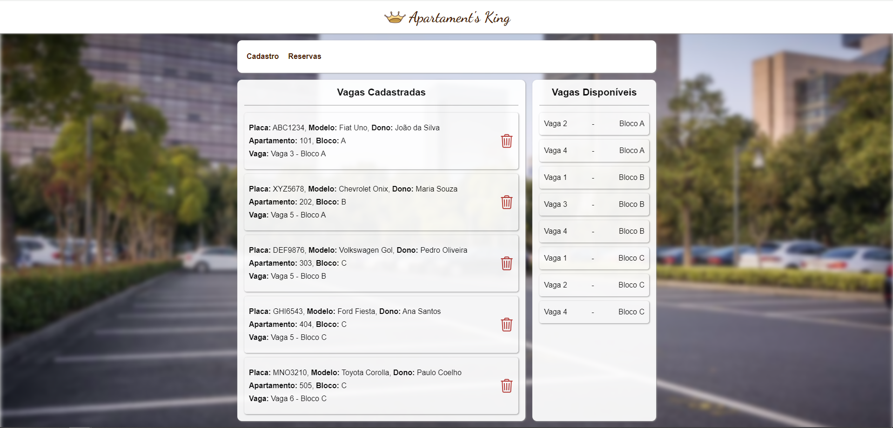

Ao clicar no botão da lixeirinha, os cadastros são deletados, e ao recarregar a página os cadastros voltam:
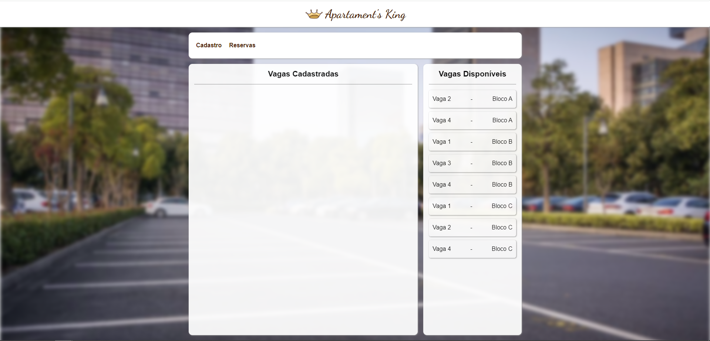

A tela de listas também é responsiva:
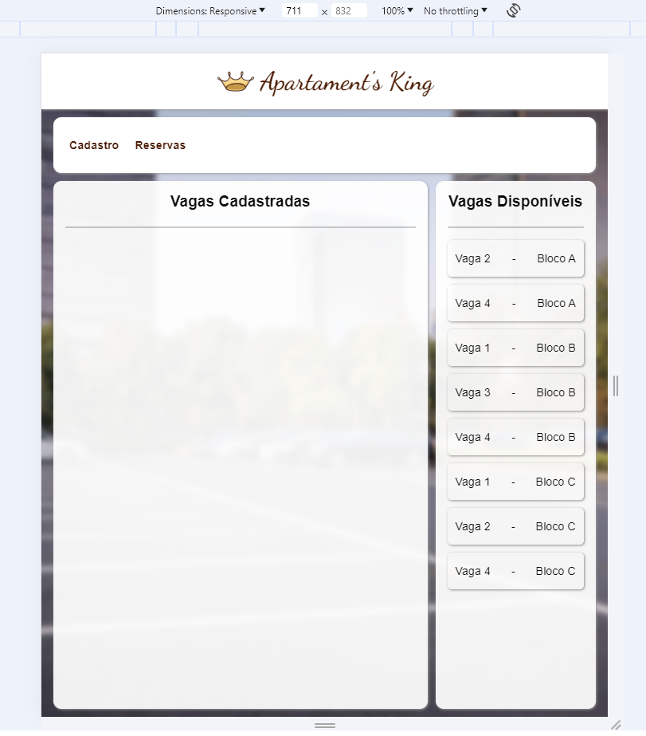
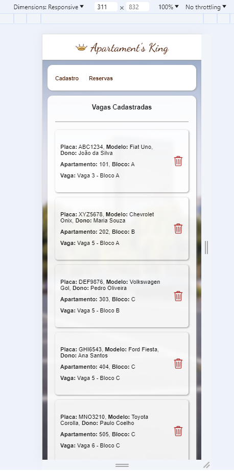
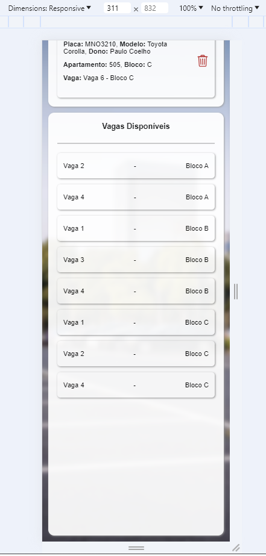
